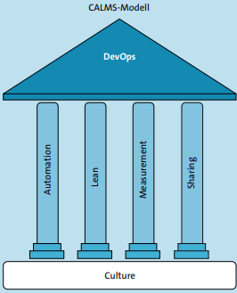

# DevOps_Kultur.md

## Einführung

### Ursprung DevOps
DevOps entstand, weil Entwicklung (Dev) und Betrieb (Ops) besser zusammenarbeiten sollte.
Ziel war es  schnellere und zuverlässigere Softwarebereitstellungen zu ermöglichen.

### Agile Manifesto und DevOps
Agile macht die Entwicklung schneller und flexibler. DevOps sorgt dafür, dass Entwicklung und Betrieb gemeinsam arbeiten und die Software schnell und stabil ausgeliefert werden kann.

### DevOps-Kultur und Prinzipien

Alle Teammitglieder tragen Verantwortung für die Software, von der Entwicklung bis zur Wartung.

Fehler sollen dabei als Möglichkeit zum Lernen gesehen werden. Teams sammeln Feedback und verbessern ihre Prozesse immer weiter.

https://gitlab.com/ch-tbz-it/Stud/m324/-/blob/main/Kultur/DevOpsEinfuehrung.md?plain=0

---

## CALMS

C - Culture: Entwicklung und Betrieb sollen nicht getrennt arbeiten, sondern gemeinsam an denselben Zielen. Wichtig sind Zusammenarbeit, Vertrauen und ein guter Umgang mit Fehlern.

A – Automation: Wiederkehrende Aufgaben sollen möglichst automatisiert werden, zum Beispiel Tests, Deployment und Monitoring. Automatisierung allein bedeutet aber noch nicht automatisch DevOps!
L – Lean: Alles, was keinen Mehrwert bringt, soll möglichst entfernt werden. Prozesse sollen laufend verbessert werden und sich auf den Nutzen für die Kunden konzentrieren.
M – Measurement: Mit Metriken wird gemessen, wie gut Prozesse funktionieren. So kann man zum Beispiel prüfen, wie lange eine Änderung braucht, bis sie beim Nutzer ankommt.
S – Sharing: Wissen, Erfahrungen und auch Fehler sollen geteilt und dokumentiert werden, damit andere daraus lernen und dieselben Fehler nicht wiederholen.

https://gitlab.com/ch-tbz-it/Stud/m324/-/blob/main/Kultur/CALMS.md?plain=0

---
